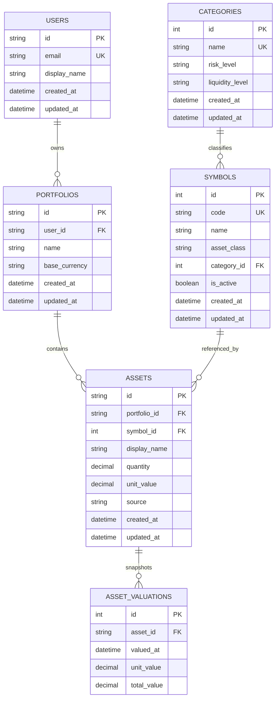

# AssetsBoard ERD

## Scope

This document models:
1. Current frontend/localStorage data structures.
2. Target backend relational schema for authenticated persistence.
3. Migration approach from localStorage to relational records.

## 1) Current Frontend Data Model (Local-First)

### Storage keys
- `assets`: JSON array of Asset objects.
- `theme`: scalar string (`light` or `dark`).

### Current logical entities

#### Asset (localStorage, mutable array)
- `id` (number, generated by array length + 1, not globally stable)
- `name` (string)
- `categoryId` (number, references static category list)
- `symbol` (string, used by update/delete selectors in current services)
- `quantity` (number)
- `value` (number, latest unit value)

#### Category (in-memory static repository)
- `id` (number, static)
- `name` (string)
- `risk` (`High|Low`)
- `liquidity` (`High|Low`)

#### Symbol catalog views (aggregated VO)
- `symbol` (string)
- `categoryId` (number)
- `categoryName` (string)
- `value` (number)

Note:
- Current catalogs are assembled from front-end repositories, not relational tables.

## 2) Target Backend Relational Model

### Design goals
- User-scoped assets with durable identity.
- Normalized categories and symbols.
- Support CRUD, lookup, and migration from local records.

### Entities and fields

#### users
- `id` (PK, bigint/uuid)
- `email` (unique)
- `display_name`
- `created_at`
- `updated_at`

#### categories
- `id` (PK, smallint/int)
- `name` (unique)
- `risk_level` (enum: high, low)
- `liquidity_level` (enum: high, low)
- `created_at`
- `updated_at`

#### symbols
- `id` (PK, bigint)
- `code` (unique, indexed)
- `name`
- `asset_class` (enum: crypto, real_estate, commodity, stock, bond, cash)
- `category_id` (FK -> categories.id)
- `is_active` (bool)
- `created_at`
- `updated_at`

#### portfolios
- `id` (PK, bigint/uuid)
- `user_id` (FK -> users.id)
- `name` (default: Main)
- `base_currency` (default: USD)
- `created_at`
- `updated_at`

#### assets
- `id` (PK, bigint/uuid)
- `portfolio_id` (FK -> portfolios.id)
- `symbol_id` (FK -> symbols.id)
- `display_name` (nullable, user-custom label)
- `quantity` (decimal)
- `unit_value` (decimal, latest known value)
- `source` (enum: migrated_local, manual, api_sync)
- `created_at`
- `updated_at`

#### asset_valuations (optional but recommended)
- `id` (PK)
- `asset_id` (FK -> assets.id)
- `valued_at` (timestamp)
- `unit_value` (decimal)
- `total_value` (decimal, computed snapshot)

### Keys and cardinalities
- `users 1 --- N portfolios`
- `portfolios 1 --- N assets`
- `categories 1 --- N symbols`
- `symbols 1 --- N assets`
- `assets 1 --- N asset_valuations`

## 3) Mermaid ER Diagram

## 4) Mapping: Current -> Target

### Asset mapping
- local `asset.id` -> target `assets.id` (new server-generated ID)
- local `asset.symbol` -> `symbols.code` lookup -> `assets.symbol_id`
- local `asset.categoryId` validates symbol-category consistency
- local `asset.name` -> `assets.display_name`
- local `asset.value` -> `assets.unit_value`
- local record owner inferred from authenticated `users.id` and default portfolio

### Theme mapping
- local `theme` stays frontend preference; not required in core portfolio schema.
- optional future table: `user_preferences(user_id, theme, locale, updated_at)`.

## 5) Migration Notes: localStorage to Relational

1. Authenticate user and create/find default portfolio.
2. Read and parse localStorage `assets` safely.
3. For each record, resolve `symbols.code` from local `symbol`.
4. Insert asset rows using resolved `symbol_id` and current portfolio id.
5. Mark `source = migrated_local` for auditability.
6. Return id map to frontend (`local id/symbol` -> `server asset id`).
7. Switch client CRUD to id-based operations only.
8. Keep one-time migration guard to prevent duplicate imports.

### Data quality checks during migration
- Reject rows with missing symbol or non-numeric quantity/value.
- Log unresolved symbols for manual remediation.
- Deduplicate by `(portfolio_id, symbol_id)` policy if required.

## 6) Implementation Notes for This Repository

- Current asset storage logic: `assets-board/src/app/shared/assets/assets-repository.service.ts`.
- Current category catalog: `assets-board/src/app/shared/categories-repository.service.ts`.
- Current symbol aggregation: `assets-board/src/app/shared/symbols-repository.service.ts`.
- Current domain contracts: `assets-board/src/app/domain/*.type.ts`.
