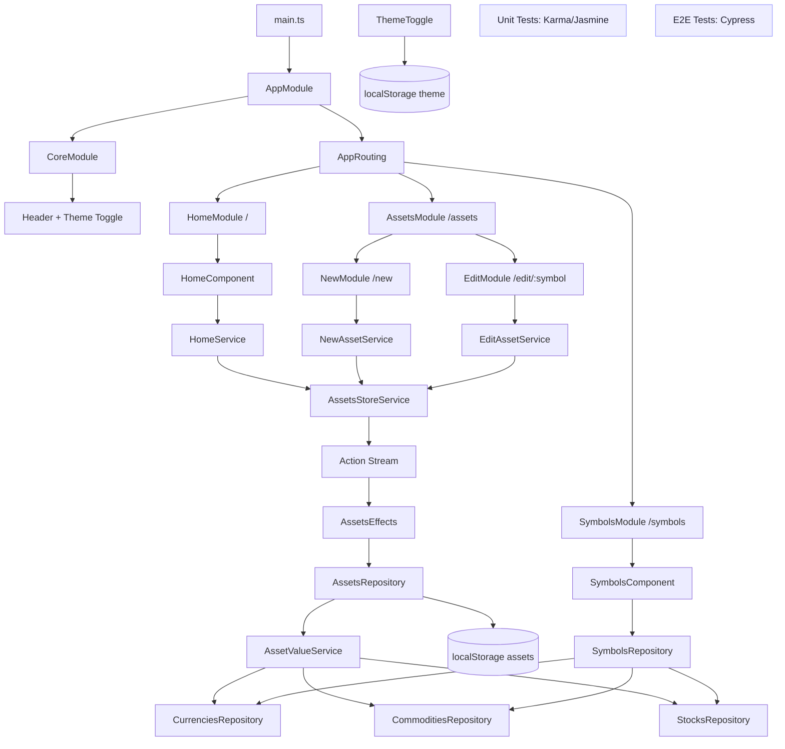

# Quick Architecture Diagram

## Layer Notes

1. Shell and routing: app starts in main, loads root module, then lazy-loads route modules.
2. Feature modules: home, assets (new/edit), and symbols each own their UI + orchestration service.
3. State model: custom store + action stream + effects, instead of NgRx.
4. Persistence: assets and theme are persisted in localStorage.
5. Data providers: repositories are in-memory/fake and return Observables for a backend-like flow.

## Workshop Discussion Points

1. Why this custom store is easy to understand but risky at scale.
2. How to migrate incrementally toward cleaner effect orchestration.
3. Where to add anti-corruption layers before introducing real APIs.
4. How to keep tests resilient while refactoring legacy structure.
